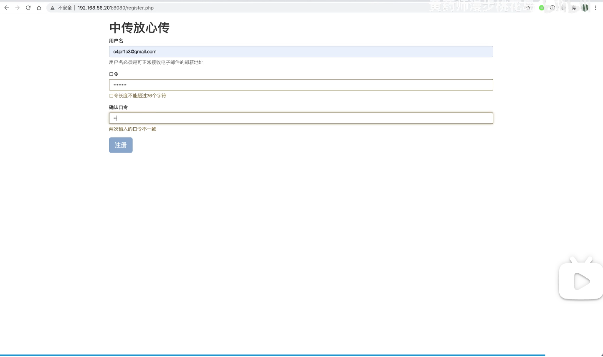

# 中传放心传

## 测试
---
本项目是 [中国传媒大学密码学应用实践课程](https://c4pr1c3.github.io/cuc-wiki/ac.html) 的一个样例工程。

## 功能清单

* 基于网页的用户注册与登录系统
  * 允许用户注册到系统
    * 用户名强制要求为电子邮件地址
    * 用户口令长度限制在36个字符之内
    * 对用户输入的口令进行强度校验，禁止使用弱口令
  * 使用合法用户名和口令登录系统
  * 禁止使用明文存储用户口令 
    * 存储的口令即使被公开，也无法还原/解码出原始明文口令
    * 扫码登录
* 基于网页的文件上传加密与数字签名系统
  * 已完成《基于网页的用户注册与登录系统》所有要求
  * 限制文件大小：&lt; 10MB（可通过代码配置）
  * 限制文件类型：office文档
  * 匿名用户禁止上传文件
  * 对文件进行对称加密存储到文件系统，禁止明文存储文件 
  * 文件秒传：服务器上已有的文件，客户端禁止重复上传
  * 支持多文件同时上传
  * 提供文件上传预览
  * 用户可以浏览自己上传的所有文件
  * 用户可以删除自己上传的文件
* 基于网页的加密文件下载与解密
  * 已完成《基于网页的文件上传加密与数字签名系统》所有要求 
  * 客户端输入文件分享码获取解密后的文件
  * 提供已登录用户下载自己上传的解密后文件
  * 下载URL设置有效期（限制时间和限制下载次数），过期后禁止访问 

样例工程完成的功能和实际小学期要求完成的大作业功能有一些差异，具体请查看[课程教学Wiki](https://c4pr1c3.github.io/cuc-wiki/ac/2019/index.html#_5)。

同学们可以参考这个样例工程中的代码，自行修改或采用其中的代码片段以完成尽可能多的作业要求。

## 本项目用到的关键技术

* 前端使用的 js 框架依赖已在 `src/package.json` 中定义，`build.sh` 中已通过 Docker 的方式一次性下载所有依赖到指定目录；
* 后端使用原生 PHP 编写，没有使用任何框架；
* 程序部署运行环境采用 docker，如果本机已配置好 docker 运行时环境可以通过执行 `bash build.sh` 自动完成程序的发布和部署；

## 快速上手体验

本样例工程通过 `bash build.sh` 方式部署后，打开浏览器访问： [http://localhost:8080](http://localhost:8080) 即可快速体验系统所有功能。

## 依赖环境安装补充说明

* `build.sh` 的执行需要 `root` 权限，普通用户可以 `sudo bash build.sh` ，建议直接切换到 `root` 用户身份的 `shell` 解释器环境执行 `bash build.sh`
    * 要确保 `docker-compose` 全局安装，可以参考附录里的 `解决 sudo docker-compose 时找不到 docker-compose 的问题`
* 国内特殊网络环境条件下，安装 `docker` 和从 `Docker Hub` 拉取基础镜像可能会无法正常完成，建议使用 **可靠** 镜像源和缓存。推荐：
    * [安装 docker 主程序指南](http://mirrors.ustc.edu.cn/help/docker-ce.html)
    * [加速访问 Docker Hub 指南](http://mirrors.ustc.edu.cn/help/dockerhub.html)

## 演示

[](https://www.bilibili.com/video/BV1Hb4y1R7FE?p=119)

## 附录-1：项目测试验证环境信息

```
Client:
 Version:	17.12.0-ce
 API version:	1.35
 Go version:	go1.9.2
 Git commit:	c97c6d6
 Built:	Wed Dec 27 20:03:51 2017
 OS/Arch:	darwin/amd64

Server:
 Engine:
  Version:	17.12.0-ce
  API version:	1.35 (minimum version 1.12)
  Go version:	go1.9.2
  Git commit:	c97c6d6
  Built:	Wed Dec 27 20:12:29 2017
  OS/Arch:	linux/amd64
  Experimental:	false
```

## 附录-2：Ubuntu 18.04 上配置本项目

如果你在安装和使用 `pip` 时遇到类似如下的[错误](https://github.com/pypa/pipenv/issues/2122)：

```
➜ pip
Traceback (most recent call last):
  File "/usr/bin/pip", line 9, in <module>
    from pip import main
ImportError: cannot import name main
```

那么请看以下我的成功配置操作记录。

```bash
sudo apt-get update

sudo apt install python3 python3-pip

# 注意以下 2 行指令操作相当于不再保留 python 2.7.x 环境
# 如果你需要 python 2.7.x 环境，建议使用 pyenv 方式安装配置和使用
sudo update-alternatives --install /usr/local/bin/python python /usr/bin/python3 100
sudo update-alternatives --install /usr/local/bin/pip pip /usr/bin/pip3 100

# 经过上述 2 行指令操作，系统中默认执行 python 和 pip 都是调用 Python3 运行环境

# 将 python3-pip 相关的可执行程序所在目录设置到当前用户 PATH 环境变量的最高优先级
grep -q 'PATH=${HOME}/local/.bin:$PATH' ~/.bashrc || echo 'PATH=${HOME}/local/.bin:$PATH' >> ~/.bashrc

# 使得上述环境变量变更生效
source "${HOME}/.bashrc"

# 测试安装 pipenv 
pip install pipenv

# 验证上述 python3 环境配置正确无误
pipenv --version

# 开始准备安装 Docker-CE
sudo apt-get install -y \
    apt-transport-https \
    ca-certificates \
    curl \
    software-properties-common
curl -fsSL https://download.docker.com/linux/ubuntu/gpg | sudo apt-key add -

# 使用中科大镜像源代替 docker 官方 DEB 镜像源
sudo add-apt-repository \
   "deb [arch=amd64] https://mirrors.ustc.edu.cn/docker-ce/linux/ubuntu \
   $(lsb_release -cs) \
   stable"

# 安装 docker-ce
sudo apt-get install docker-ce

# 修改 docker pull 使用的 Docker Hub 镜像源为中科大 Docker 镜像源
[[ -f /etc/default/docker.orig ]] || {
  sudo cp /etc/default/docker /etc/default/docker.orig
  echo 'DOCKER_OPTS="--registry-mirror=https://docker.mirrors.ustc.edu.cn/"' >> /etc/default/docker
}

# 重启 docker 守护进程
sudo systemctl restart docker

# 安装 docker-compose
pip install docker-compose --user

# 解决 sudo docker-compose 时找不到 docker-compose 的问题
sudo update-alternatives --install /usr/local/bin/docker-compose docker-compose $HOME/.local/bin/docker-compose 100

# enjoy ac-demo
```

