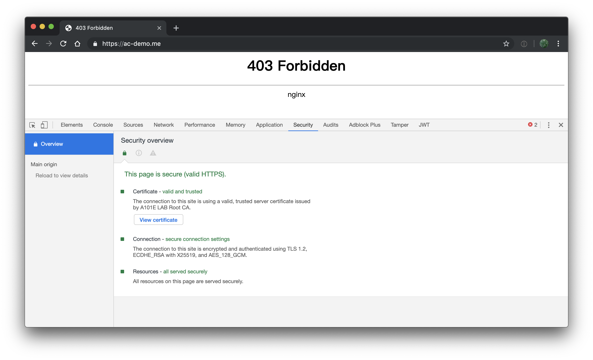

# 自签发一个包含完整证书链的网站服务器证书

## 快速上手

当前目录下的相关脚本展示了如何自签发一个包含完整证书链的网站服务器证书的方法，测试环境为 `LibreSSL 2.6.5 on macOS` 。

在本地开发测试时，可以通过修改 [hosts](https://www.howtogeek.com/howto/27350/beginner-geek-how-to-edit-your-hosts-file/) 文件来添加任何你喜欢的域名并将其解析到 `127.0.0.1` 。以下例子里使用的自定义域名是 `ac-demo.me` ，对应 `hosts` 文件里需要添加以下内容：

```ini
127.0.0.1 ac-demo.me
```

第一次运行本目录中脚本时，按照顺序执行以下脚本即可。

**注意脚本执行过程中的交互式输入提示信息，仔细阅读后正确填写。**

```bash
# 创建自签名的根 CA 证书对
bash 0_create_the_root_pair.sh

# 使用根 CA 证书给新创建的中级 CA 证书对签名
bash 1_create_the_intermediate_pair.sh

# 使用中级 CA 证书对域名为 ac-demo.me 的网站服务器证书签名
bash 2_sign_server_and_client_certs.sh ac-demo.me

# 移除网站服务器证书私钥的口令保护以支持服务器的自动重启时无需交互式输入私钥口令
# 该脚本生成的是可以用于 nginx 服务器的证书对
bash 3_create_nginx_certs.sh ac-demo.me

# 生成域名为 ac-demo.me 的 HTTPS 站点证书测试容器用 docker-compose.yml
bash 4_build_docker-compose.sh ac-demo.me

# 启动本地可访问的测试 https 站点，测试新部署的证书
docker-compose up -d

# 在已有根 CA 证书对和中级 CA 证书对时
# 从 2_sign_server_and_client_certs.sh 脚本开始顺序执行即可签发不同域名的网站服务器证书

```
- 注意事项：
  1. 在原脚本的基础上，需要对每个脚本进入vim编辑界面，执行set ff=unix ，使vi 编辑器，使用unix换行符
  2. 除了更改<DOMAIN>内容为对应域名，需要更改`2_sign_server_and_client_certs.sh`脚本中第20行的部分内容

```bash
	if [[ ! -f "intermediate/${domain}.openssl.cnf" ]];then

 	cat "intermediate/openssl.cnf.example" | sed "s#<CA_default_dir>#$PWD/intermediate#g"  > "intermediate/openssl.cnf.example.tmp"
 	
	# $*.{domain}改为 ${domain}，否则绑定的域名实际上为*.ac-demo.me
 	cat "intermediate/openssl.cnf.example.tmp" | sed "s#<DOMAINS>#$*.{domain}#g"  > "intermediate/${domain}.openssl.cnf"

 	cp "intermediate/${domain}.openssl.cnf" "intermediate/openssl.cnf"

	fi
```
​	3.在所有脚本执行结束后，在脚本同目录下生成了一个certs文件夹，将文件夹内生成的`pem`后缀文件更改后缀为`crt`并安装证书到受信任的根证书颁发机构。
  4. 用openssl工具生成csr（其中包含参数设置信息即证书用于什么目的），生成csr过程中会在本地生成一个私钥文件
​ 5. 用根证书对csr文件以及相应的公钥文件进行签名得到最后的被签名了的公钥证书sign_pem  
  6. 仔细填写交互内容，注意在三级证书颁发时填写的common name需要和待绑定域名相同。
  
## 最终效果展示 

 

> 需要「添加自签发的 SSL 证书为受信任的根证书」才能在浏览器中看到以上效果。

## 参考文献

* [OpenSSL Certificate Authority by Jamie Nguyen](https://jamielinux.com/docs/openssl-certificate-authority/)
* [Getting Chrome to accept self-signed localhost certificate](https://stackoverflow.com/questions/7580508/getting-chrome-to-accept-self-signed-localhost-certificate/43666288#43666288)


